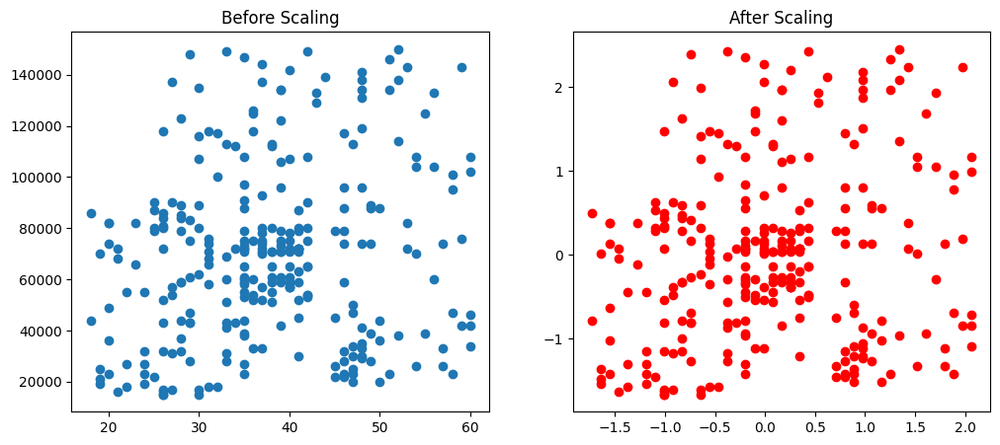
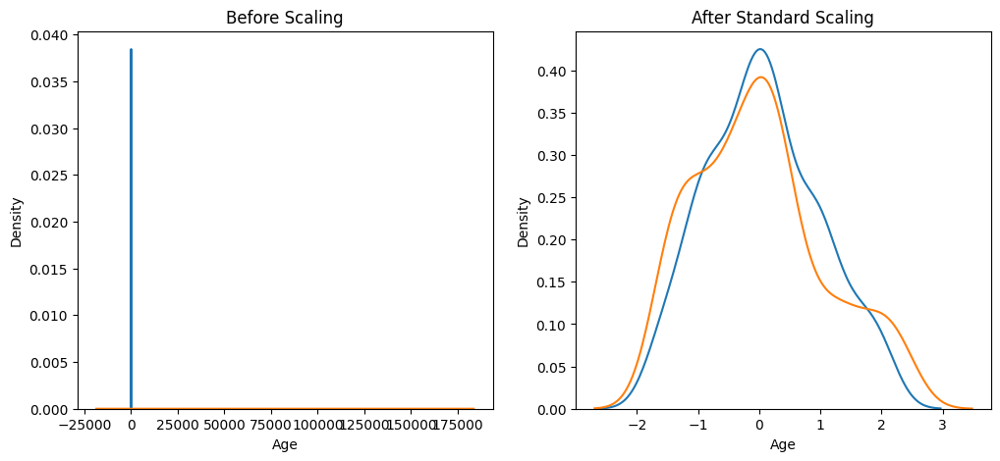
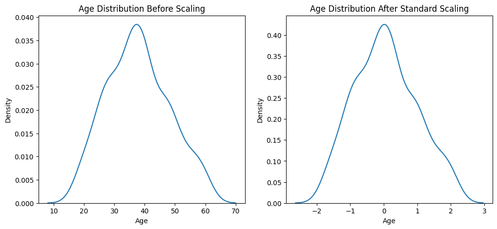
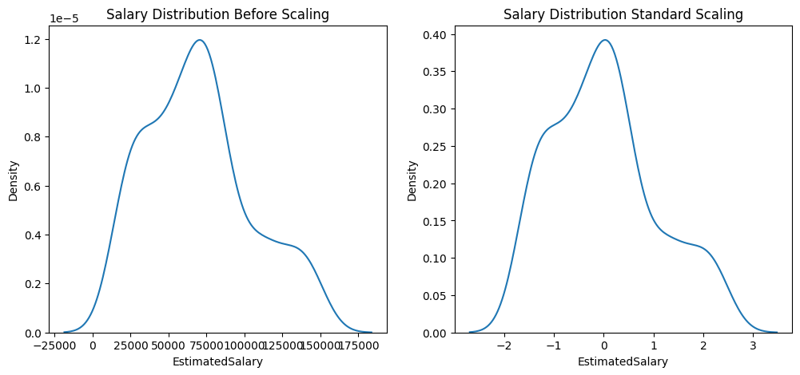

# Standardization in Data Scaling

## Overview

This project demonstrates the process of **standardization** in data scaling using the machine learning model `StandardScaler`. The aim is to investigate the effects of standardization on a dataset and to visualize the differences in model performance before and after standardization.

## Table of Contents

- [Introduction](#introduction)
- [Why Standardization?](#why-standardization)
- [Dataset](#dataset)
- [Methodology](#methodology)
- [Results](#results)
- [Visualizations](#visualizations)
- [Conclusion](#conclusion)
- [Screenshots](#screenshots)

## Introduction

Standardization is a crucial preprocessing step in machine learning that transforms features to have a mean of zero and a standard deviation of one. This project explores its significance and demonstrates how it impacts model performance.

## Why Standardization?

1. **Improves Model Performance:** Many algorithms are sensitive to the scale of the features. Standardization ensures that each feature contributes equally to the distance calculations.
2. **Accelerates Convergence:** Gradient descent methods converge faster with standardized data.
3. **Facilitates Comparisons:** Makes it easier to compare results across different models.

## Dataset

The dataset used in this project contains various features that require standardization. Specific details about the dataset, including its origin and structure, can be added here.

## Methodology

1. **Data Preprocessing:**
   - Load the dataset.
   - Split the data into training and testing sets.

2. **Standardization:**
   - Apply `StandardScaler` to the dataset.
   - Compare the scores of a machine learning model on the original and standardized datasets.

3. **Evaluation:**
   - Evaluate the performance of the model before and after standardization using appropriate metrics.

## Results

The results show a significant difference in model performance before and after standardization. Experimentation revealed improved scores on the standardized dataset.

### Performance Scores

- **Original Dataset Score:** [60%]
- **Standardized Dataset Score:** [80%]

## Visualizations

Charts were plotted to visualize the effects of standardization on the dataset. The following types of visualizations were included:
- Distribution plots of features before and after standardization.
- Comparison charts of model performance.

## Screenshots

Include relevant screenshots here to showcase your findings and visualizations. For example:

*Figure 1: Distribution of features before standardization.*

*Figure 2: Distribution of features after standardization.*

*Figure 3: Distribution of features after standardization.*

*Figure 4: Distribution of features after standardization.*

## Conclusion

Standardization is a vital preprocessing step that can significantly enhance the performance of machine learning models. This project highlights the importance of proper data scaling and provides insights into its effects through experimental validation.

